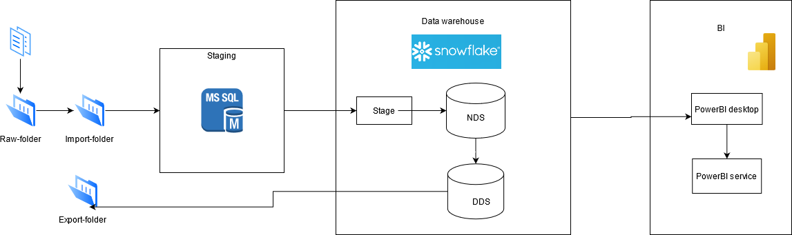
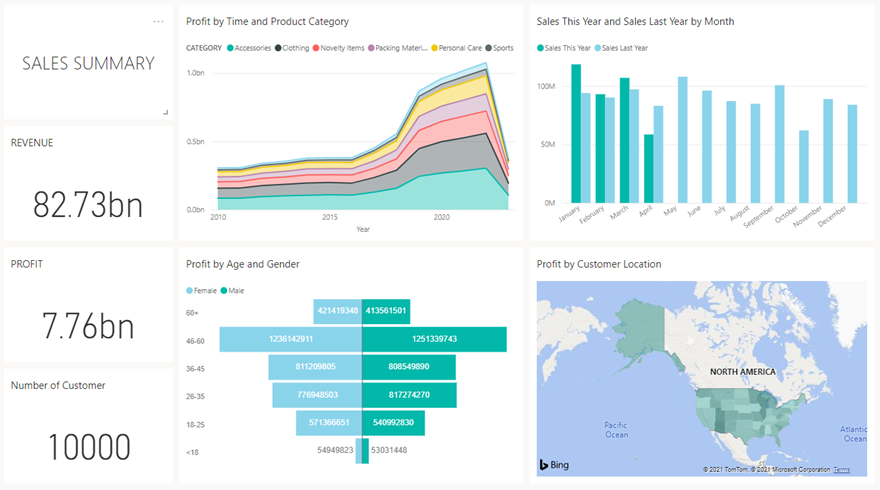

# FA_project1
## Project Topic
### E-commerce/Retails
Sales/Customer analysis and trend prediction.

## Decsription of this project
This project is using for demo to FA about how to initialize a project and draft data pipeline.

## Purpose
Building the data pipeline

## Detail of Work
1. Design data pipeline [here](./docs/design.png "Architecture")
2. Ingest data from flat file
3. Extract, captured new and changed data
4. Load new and changed data onto Snowflake
5. Normalize and Denormalize data
6. Build data model
7. Visualize your data

## How to setup
1. [Download](https://sfc-repo.snowflakecomputing.com/snowsql/index.html) and install snowsql CLI.
2. Go to **%USERPROFILE%\\.snowsql\\** to change login config for better automation, using [this document](https://docs.snowflake.com/en/user-guide/snowsql-config.html).
3. Generate data: **python Data_generator.py**, copy into resources/raw-folder.
4. Login into MSSQL, create a new *Credentials* (Server > Security > Credentials > New Credentials...), fill following field: 
    i. Credential name: runcmd.  
    ii. Identity: *click ... > Advanced...> Find now* and choice your current window's account.  
    iii. Enter your window's account password in Password and Confirm password.  
    iv. Click OK to create *Credentials*.  
5. Run [init_mssql.sql](./src/MSSQL/init_mssql.sql) to set up local database, job and schedule, you can change schedule time and frequency as needed.
6. Run **/src/SSIS/Project1.sln**, change **"ProjectPath"** variable to your project path and **"ErrorEmail"** variable to your email. If you get errors on connection, edit **Project1** Connection in **Connection Managers**.
7. Deploy **Project1.sln** on SQL Server: 
    i. Open **Project1.ispac** under **Project1\bin\Development**. 
    ii. Under **"Select Source"** follow the default Project Deployment, with the path pointing to the **"Project1.ispac"** package. 
    iii. Under **"Select Destination"** enter the name of the server that hosts the SSIS catalog. 
    iv. Select a path under the SSIS catalog, create a new folder **"Project1"**. 
    v. Finalize the wizard by clicking Deploy. 
8. Authen SnowSQL using proper user and run [init_snowflake.sql](./src/Snowflake/init_snowflake.sql).
9. Open **PowerBI**, click Get Data, search for Snowflake.
10. Connect to Snowflake server using your snowflake account.
11. Create PowerBI dashboard. 

## Snowflake trainer account
[Snowflake link](https://pv02258.ap-southeast-1.snowflakecomputing.com/)
1. User: `longbv1`               Password: `abc123`
2. User: `mainq2`                Password: `abc123`
