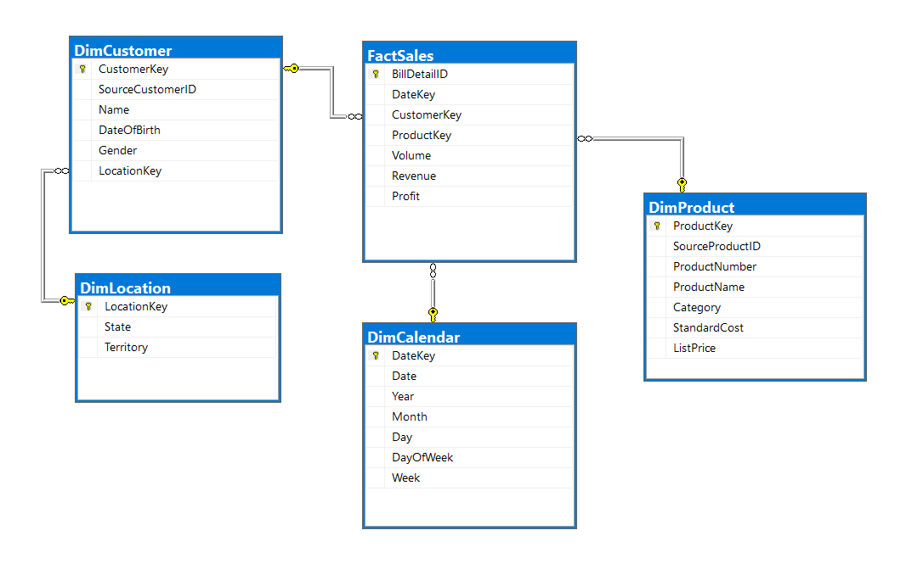

## SECOND PROJECT FA (E-commerce/Retails Project)

## I. Decsription of this project

**Define the business problem:** 
E-commerce/Retails - We is trying to *Sales/Customer* analysis and *trend prediction* (based on order history and bill details)

**Solution:**
We will need to aggregate data based on *bill details*, *customer*, *product*, *location* and *date*. It will be evaluated based on *volume*, *revenue*, *profit*.

## II. Working data

Data is generated based on Python sript. The database (.csv flat files) will include:

1. Billdetail.csv

	This file includes basics data for a bill detail such as billdetailID, order_date, customerID, productID, order_quantity, unit_price, line_profit.

2. Product.csv

	This file includes basics data for a product such as productID, product_number, product_name, standard_cost, list_price, product_category.	

3. Customer.csv

	This file includes basics data for a customer such as customerID, account, firstname, lastname, address, city, state, territory, dateofbirth, gender.

## III. Detail of work

1. Generate Data
    - Generate rawdata and copy to workfolder
2. Design data pipeline 
3. Design the dimensional model schema 
    - Defined Dimensional tables and Facts tables
    - Design logical data map 
4. Ingest data from flat file csv
    - Design SSIS package to ETL the data
    - Using SSIS stage data in SQL Server (stage)
5. Load data onto Snowflake
    - Using snowpipe load file internal stage to stage schema
    - Using snowpipe load data stage schema to DDS (Dimention Data Store)
6. Visualize data using PowerBI
   - Connect Snowflake source
   - Visualize data
   - Connect Power BI Desktop with Power BI Service

## IV. Set up
1. [Download](https://sfc-repo.snowflakecomputing.com/snowsql/index.html) and install snowsql CLI.
2. Go to **%USERPROFILE%\\.snowsql\\** to change login config for better automation, using [this document](https://docs.snowflake.com/en/user-guide/snowsql-config.html).

   Example
	accountname = qv42158
        	region = ap-southeast-1
        	username = NGHIATT99
        	password = abc

3. Generate data: **python Data_generator.py** rawfolder and copy to workfolder
4. Run [init_mssql.sql](./src/MSSQL/init_mssql.sql) to set up local database.
5. Run **/src/SSIS/Project1.sln**, change **"ProjectPath"** variable to your project path and **"ErrorEmail"** variable to your email. If you get errors on connection, edit **Project1** Connection in **Connection Managers**.
6. Deploy **Project1.sln** on SQL Server: 
    i. Open **Project1.ispac** under **Project1\bin\Development**. 
    ii. Under **"Select Source"** follow the default Project Deployment, with the path pointing to the **"Project1.ispac"** package. 
    iii. Under **"Select Destination"** enter the name of the server that hosts the SSIS catalog. 
    iv. Select a path under the SSIS catalog, create a new folder **"Project1"**. 
    v. Finalize the wizard by clicking Deploy. 
7. Config enviroment for Project after deloy.
7. Config fit with your SQL Server and run file  [setup_mssql.sql](./src/MSSQL/setup_mssql.sql): open file and repair infomation (email,credentials, proxy,operator,alert) to set up job, schedule, run package (should use interface to create avoid error field occur)
8. Authen SnowSQL using proper user and run [init_snowflake.sql](./src/Snowflake/init_snowflake.sql).
9. Open **PowerBI**, click Get Data, search for Snowflake.
10. Connect to Snowflake server using your snowflake account.
10. Create PowerBI dashboard.
## V. Dashboard
1. Overview : [here](https://app.powerbi.com/view?r=eyJrIjoiYzA5ODFkMmYtZGExNi00ZGVlLTk2NWYtN2VhZjYzNWUyODNiIiwidCI6ImYwMWU5MzBhLWI1MmUtNDJiMS1iNzBmLWE4ODgyYjVkMDQzYiIsImMiOjEwfQ%3D%3D&pageName=ReportSection)

2. Detail: [here](https://app.powerbi.com/view?r=eyJrIjoiYzA5ODFkMmYtZGExNi00ZGVlLTk2NWYtN2VhZjYzNWUyODNiIiwidCI6ImYwMWU5MzBhLWI1MmUtNDJiMS1iNzBmLWE4ODgyYjVkMDQzYiIsImMiOjEwfQ%3D%3D&pageName=ReportSection8d472ddd8910d0334b8b)

